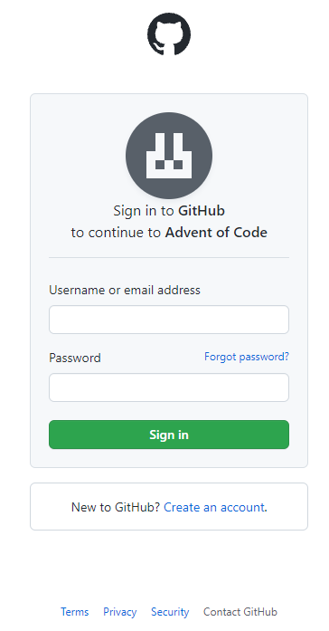
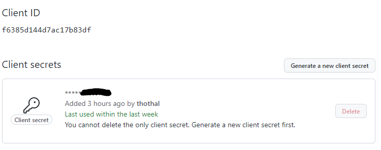

```{css custom-css, echo = FALSE}
.page-content  .figure {
  width: 100%;
}

.day-desc {
  border: 2px dotted;
  border-radius: 6px;
  border-color: var(--blockquote-border-color);
  padding: 0 20px;
}
```


```{r setup, include = FALSE}
knitr::opts_chunk$set(echo = TRUE, message = FALSE, fig.align = "center")
## Define a function to write text in typewriter font
tt <- function(x) {
  if (knitr::is_latex_output()) {
    sprintf("\\texttt{%s}", as.character(x))
  } else if (knitr::is_html_output()) {
    sprintf("<tt>%s</tt>", as.character(x))
  } else {
    x
  }
}
```

# Preamble

A tweet in my timeline called my attention to https://adventofcode.com/^[In the following 
I will refer to Advent of Code simply as `r tt("AoC")`.]. So I thought I give it a try.

To spice things up, we want to do **everything** in R, that is also getting the task from 
the webpage, downloading the data and so on. Thus, we will use library 
[`httr`](https://httr.r-lib.org/) ~~to deal with the authentication and retrieval of the 
needed data~~ and use the session cookie, whose value I shamelessly copied & pasted from a 
manual login. 

# Setup

## Libraries

First we need to load the required libraries. 

```{r libs, warning = FALSE}
library(httr)
library(xml2)
library(magrittr)
library(tibble)
library(zoo)
library(glue)
library(fontawesome)
```

## Retrieve Data from `r tt("AoC")`

### Initial Plan

Here I need to go farther back. When you look at `r tt("AoC")` you see that the 
authentication is delegated to either of the following popular services using the  [OAuth protocol](https://en.wikipedia.org/wiki/OAuth).


I am everything but an expert when it comes to server communication, so I did my research 
to look for the API specifications to understand the requests which are exchanged in the 
process of authentication:

* [`r fa("github")` GitHub](https://docs.github.com/en/developers/apps/building-oauth-apps/authorizing-oauth-apps)
* [`r fa("google")` Google](https://developers.google.com/identity/protocols/oauth2)
* [`r fa("twitter")` Twitter](https://developer.twitter.com/en/docs/authentication/overview)
* [`r fa("reddit")`Reddit](https://www.reddit.com/dev/api/oauth/)

I decided to use my [GitHub account](https://github.com/thothal) for this
purpose.

At first with my very superficial understanding, I thought `httr::oauth2.0_token` would 
handle the authentication for me. But right after reading the documentation, I realized 
that I am missing some information (like the client id or even more importantly the
client secret). Yet I did not give up. I logged in manually to `r tt("AoC")` and was 
redirected (as per `r tt("OAuth")` protocol) to a GitHub login page:



As I knew already from the API docs, the first step was to send a `r tt("GET")` request to 
https://github.com/login/oauth/authorize containing - inter alia - the `r tt("client_id")` 
and a `r tt("redirect_uri")`. `r tt("GET")` requests mean that the query parameters are 
simply appended to the URL, so I could simply get the `r tt("client_id")` from the 
navigation bar^[Alternatively I could also look into the `r tt("Network")` section of the 
[DevTools of my Chrome browser](https://developer.chrome.com/docs/devtools/).] and I found 
the relevant `r tt("client_id")`: 
`r tt("https<!-- use to break the link -->://github.com/login?client_id=7bb0a7ec13388aa67963&[...]")`. 
With this piece of information and still no deep understanding of the "dance" I simply 
tried to set up an authentication as per the 
[demo of httr](https://github.com/r-lib/httr/blob/main/demo/oauth2-github.r) (silently 
ignoring that I still had no client secret `r emo::ji("see-no-evil monkey")`):

```{r oauth, eval = FALSE}
myapp <- oauth_app("github",
  key = "7bb0a7ec13388aa67963"
)
github_token <- oauth2.0_token(oauth_endpoints("github"), myapp)
```

My first enthusiasm yielded quickly to disillusion. While this approach was properly 
opening the login page, the redirect did not work and in the `r tt("GET")` parameters I 
also saw why:


I learned, that I can not redirect the request to my localhost, which would be needed to 
proceed with the next step (the API told me that I should receive a temporary code). I 
guess that this safety measure is a good thing such that you cannot simply redirect the 
process.

Anyways, my interest was sparked and I wanted at least to understand the dance. And of 
course I still wanted to follow this route to login to `r tt("AoC")`. I quickly drafted a
[StackOverflow 
question](https://stackoverflow.com/questions/70206455/log-in-a-webpage-which-uses-github-oauth) 
asking for help for the overall goal. Here's what I did in more detail:

First, I set quickly set up a test OAuth App in my GitHub account: 


This time I got both the client id *and* the client secret. Hooray!



Time to start the "dance"! As a warm-up we can do that easily using 
`httr::oauth2.0_token` as per the [demo](https://github.com/r-lib/httr/blob/main/demo/oauth2-github.r):

```{r oauth2, cache = TRUE}
client_id <- "f6385d144d7ac17b83df"
client_secret <- keyring::key_get("OAUth_Test_Client-Secret") ## sorry folks ;)
myapp <- oauth_app("test_oauth",
                   key = client_id,
                   secret = client_secret)
github_token <- oauth2.0_token(oauth_endpoints("github"), myapp)
gtoken <- config(token = github_token)
GET("https://api.github.com/rate_limit", gtoken)
```

Worked pretty smooth, didn't it? Yet I wanted to understand each part of the dance. Thus,
instead of relying on the blackbox `oauth2.o_token` I constructed all the necessary calls
separately which helped me to finally understand (or so I think) what is going on under 
the hood:

```{r oauth-by-hand, cache = TRUE}
base_url <- "https://github.com"
path <- "login/oauth/{end_point}"
## oauth_callback() --> http://localhost:1410/
url <- modify_url(base_url,
                  path = glue(path, end_point = "authorize"),
                  query = list(client_id = client_id,
                               redirect_uri = oauth_callback()))
## This opens a web browser pointing to the url and 
## opens a webserver on port 1410 to listen to the response. 
code <- oauth_listener(url)

## Provide credentials in the spawned browser
access_token <- POST(modify_url(base_url, 
                                path = glue(path, end_point = "access_token")),
                     add_headers(Accept = "application/json"),
                     body = list(client_id = client_id,
                                 client_secret = client_secret,
                                 code = code$code))
GET("https://api.github.com/rate_limit", 
    add_headers(Authorization = paste(content(access_token)$access_token,
                                      "OAUTH-TOKEN")))
```

Booom! My key take away messages from here:

1. You need a web server to participate in the dance (`r tt("https<!---->://localhost")` 
is just fine).
1. You cannot (at least for GitHub authentication) redirect the response form the 
authorize service but to the callback URL.
1. Because you cannot redirect the response with the code, you can authenticate only
at the service defined by the callback URL.
1. Thus, you **cannot** remotely authenticate via a script. Full stop.^[As said, I am a 
novice when it comes to authentication processes. Thus, if you know a way how I could 
authenticate, please let me know, either by answering my [SO
question](https://stackoverflow.com/questions/70206455/log-in-a-webpage-which-uses-github-oauth), 
issuing a PR on this document or by good old email.]


While this helped tremendously to understand the `r tt("OAuth")` protocol it did 
not help a bit to extract the data via script as I could not log on.

I was just about to give up, when I made a last Google search on 
`r tt("how to login curl adventofcode")` and I found [this gem](https://github.com/wimglenn/advent-of-code-data). A python library to download the
`r tt("AoC")` data. But how the heck did they manage to authenticate? And here's where the 
pieces fall into place. I learned that all I have to do is to

1. Log on `r tt("AoC")` manually.
1. Get the [session cookie ](https://github.com/wimglenn/advent-of-code-wim/issues/1).
1. Eventually use the session cookie to authenticate our requests.

Et voilà. Quite some trial and error until I found out that the solution is rather easy.
But as always, I learned an awful lot.

### Final Solution

```{r get-data, cache = TRUE}
session_cookie <- set_cookies(session = keyring::key_get("AoC-GitHub-Cookie"))
puzzle_1 <- GET("https://adventofcode.com/2021/day/1",
                session_cookie) %>% 
  content(encoding = "UTF-8") %>% 
  xml_find_all("///article") %>% 
  lapply(as.character)

data_1 <- GET("https://adventofcode.com/2021/day/1/input",
              session_cookie) %>% 
  content(encoding = "UTF-8") %>% 
  read.table(text = .) %>% 
  as_tibble() %>% 
  set_names("depth")
```

# Puzzle Day 1

## Part 1

### Description

```{r show-puzzle-a, echo = FALSE, results = "asis"}
cat(puzzle_1[[1]])
```

### Solution

We need to count how often the depth measurement increases, which breaks down to counting
the positive signs of the differences of consecutive numbers:

```{r solution-a}
sgn_a <- data_1$depth %>% 
  diff()
sum(sgn_a > 0)
```

## Part 2

### Description

```{r show-puzzle-b, echo = FALSE, results = "asis", eval = length(puzzle_1) > 1}
cat(puzzle_1[[2]])
```

### Solution

Now we need to do the same but not for the single measurements, but for the consecutive
sum of 3 elements. We can conveniently use `zoo::rollsum`:

```{r solution-b, eval = length(puzzle_1) > 1}
sgn_b <- data_1$depth %>% 
  rollsum(3) %>% 
  diff()
sum(sgn_b > 0)
```

